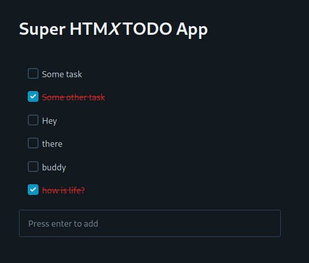

# HTMX TODO

Frontend hater trying out [HTMX][1] and having to come to term that he actually may enjoy frontend now.

[Pico.css][2] allowed me to not have to write CSS, thank you buddy.



## Features

- Add a task
- Mark a task as complete
- Edit a task
- Cure your depression

## Usage

```
go mod download
go run main.go
```

[1]: https://htmx.org
[2]: https://picocss.com/
